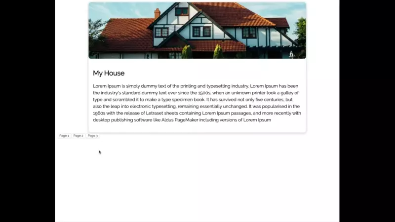

# NgViewStepper

### Put animated transitions anywhere

NgViewStepper is a tool created to allow you to place flexible animated transitions anywhere in your Angular projects.



### Installation

Install from NPM
`npm i ng-view-stepper`

Add it to a module in your Angular App. Ensure that you have included BrowserAnimationsModule as well, the prebuilt animations rely on AnimationBuilder so you should install the web-animations polyfill.

```typescript
import { BrowserAnimationsModule } from "@angular/platform-browser/animations";
import { NgViewStepperModule } from 'ng-view-stepper'

@NgModule({
    imports: [..., BrowserAnimationsModule, NgViewStepperModule]
})
```

Currently supports Angular 7&8

### Usage

To use NgViewStepper to transition between views, declare an ng-view-stepper parent and then add as many ng-view-stepper-view children as you have pages. Then as children to that define your view in an ng-template.
Within the ng-template there should be one root element to house the view.

```html
<ng-view-stepper #viewStepper="ngViewStepper" [initialViewKey]="'page-2'">
  <ng-view-stepper-view key="page-1">
    <ng-template>
      <div>
        Content on page 1
      </div>
    </ng-template>
  </ng-view-stepper-view>
  <ng-view-stepper-view key="page-2">
    <ng-template>
      <div>
        Content on page 2
      </div>
    </ng-template>
  </ng-view-stepper-view>
  <ng-view-stepper-view key="page-3">
    <ng-template>
      <div>
        Content on page 3
      </div>
    </ng-template>
  </ng-view-stepper-view>
</ng-view-stepper>
```

Then to transition views you can get a reference to the stepper either with a ViewChild query or using the exported template variable, and call the `goToView(pageKey)` function which will execute the transition to that view.

```typescript

@Component({ ... })
class MyComponent {
    @ViewChild(NgViewStepper) viewStepper: NgViewStepper;

    onButtonClick() {
        this.viewStepper.goToView('page-3');
    }
}

```

### Custom animations

By default the view stepper uses a pre-defined animation to execute the transition, but you can specify your own implementation of the `ViewStepperAnimation` interface and pass it in as an input to the `animationRunner` property.

```html
<ng-view-stepper [animationRunner]="myAnimation">
  ...
</ng-view-stepper>
```

##### ViewStepperAnimation interface

```typescript
export abstract class ViewStepperAnimation {
  abstract execute(
    currentViewNode: HTMLElement,
    currentViewBoundingRect: ClientRect,
    currentViewIndex: number,
    targetViewNode: HTMLElement,
    targetParentBoundingRect: ClientRect,
    targetViewIndex: number,
    viewParentNode: HTMLElement,
    viewParentBoundingRect: ClientRect
  ): Promise<() => void>;
}
```

The view stepper will wait for the promise to resolve before finishing the step transition.

A simple opacity implemenation using a css class based animations that take 300ms might look like this

```typescript
class OpacityAnimation implements ViewStepperAnimation {
  async execute(
    currentViewNode: HTMLElement,
    currentViewBoundingRect: ClientRect,
    currentViewIndex: number,
    targetViewNode: HTMLElement,
    targetParentBoundingRect: ClientRect,
    targetViewIndex: number,
    viewParentNode: HTMLElement,
    viewParentBoundingRect: ClientRect
  ) {
    return new Promise(r => {
      currentViewNode.addClass('fade-out');
      targetViewNode.addClass('fade-in');
      setTimeout(r, 300);
    });
  }
}
```

You should have access to enough data to make very interesting animations if you choose to.

Note: if you resolve the promise with a function, it will execute the function after destroying the leaving DOM node, which is a good time to perform any additional post animation cleanup logic if you need to.

### Roadmap

This is a small tool that I built to help me re-use a common pattern in the work I do. If it ends up finding use outside of a small group of people I have some plans to enhance features and am also open to contributions for new features other people find useful.

**Possible Future Features**

- More flexible pre/post animation scaffolding
- More prebuilt transitions readily available and accessible by name
- More concise usage
- Router integration
- Vanilla/Cross framework solution?
- Better usage error reporting
